```mermaid
flowchart TD
Route[ROUTE - Parameters to choose a transaction PATH] 
Route --> A[Internal]
Route --> B[External]
Route --> C[Stand-in]

Script[SCRIPT AUTH - SulfixID Script library. Change the logic without change the code..]

Limts[LIMITS - Cards expiration dates]

Refresh[REFRESH - Batch ] 
Refresh --> D[Import Cards]
Refresh --> E[Import Accounts]
Refresh --> F[Full and Partial Files]

Transaction[TRANSACTION SECURITY] --> G[HSM]

ISO8583[ISO8583] --> H[Host & Network Interface]

Map[MAP - Translate] --> L[Device handlers Native message to Internal Format]

Seq[SEQUENTIAL ROUTING] --> M[AML - PRM]

Import[FILE UPLOAD - Import Real Time ] --> N[Read, Write, Delete.]
Import --> O[Addtional components]

Journal[JOURNAL - Journal Extracting & Report] --> Export[Export]
Journal --> logs[Logs]
Journal --> batch[Batch]

list[MANAGED LIST] --> Scripts[For Scripts Authorization]



desktop[DESKTOP GUI] --> user[User Control and Audithing]

Sis[SIS - System Interface Services] --> | Interface Layer to the Operation System | os[Operational System]

end01[End-of Period Processor]
end01 --> date[Date and time]
end01 --> cut[Cut off - cutover]
end01 --> bus[Business date]
end01 --> hol[Holidays]
```

# 🧩 Transaction Path Variables and System Integrations

## 🔀 Routing & Execution Logic
- New variables for **Tunnel** & **Terminal** selection from Route
- AC-supplied script library enables dynamic logic changes _without altering code_
- Includes:
  - Auth script
  - Card Expiry & Limit logic

## 📥 Data Import Options
- Batch import:
  - Card data
  - Account info
  - Optional & Partial files

- Real-time input:
  - File upload
  - Paste directly

## 🔄 Operational Components
- **Refresh Tasks**
- **AML Monitoring**
- **PRM (Proactive Risk Manager)**
- **MDP-Translator**
- **Managed Lists**

## 🖥️ Device Handlers & Interfaces
- Native Device Handlers
- Blind format manager
- Interface Layer → Operating System (OS)
- Cloud-based Components

## 🔐 Security & Transaction Control
- ISO 8583 Host & Network Interface
- Transaction Security
- HSM Integration
- SIS (System Transfer Services)

## 🧪 Testing & Monitoring
- Test Scripts: Auth Manager API
- Desktop GUI
- Audit Tracking & User Control
- Journal Extraction & Reporting

## 📤 Log & Data Handling
- Export Logs (Batch)
- Interface for read/import in real-time

## 📅 Process Timing & Cut-off
- End-of-period flow:
  - Business Date
  - Holiday Schedule
  - Autover cut-off triggers

## 📬 Requests
- Routing logic anchored to system rules

## 🗺️ System Architecture Overview

