# 🧱 Architecture & Environment Layer Breakdown

## 🎯 Business Layer
- **Data Access**
- **Message Delivery**
- **Transaction Protection**
- **Timer / Time Logic**
- **Environment Settings**
- **Event System**

## ⚙️ Foundation Layer
### System Interface Services (SIS)
- File System
- Middleware
- Resource Manager
- Queuing System
- Event Management
- Configuration Tables

## 📊 Load Control & Performance
- Limits / Usage
- Transactions per Second (TXN/sec)
- Interfaces
- `I/3NL` logic

## 🔁 Script Engine Elements
- Journal Perusal
- Transaction Flow
- Authorization Context
- Routing
- Journal Query

## 📦 System Prefix & Components
- Configuration files for **Base24-eps Desktop**
- Web Application
- Server Components
- Base24-eps version for B24 network usage
- Prefix = 4 (system classification)

## 🔄 Time & Network
- System Time Offset
- Network Settings

## 📚 Deployment & Infra Setup
- Vagrant – Infrastructure as Code

## 🚨 Event Monitoring
- EMS – Event Management System
- NonStop Only

## 📝 Documentation & Utilities
- **Checklist**: Purchase software
- **Worksheet**: Parameters and values
- File contains install specs and configuration hints

---

```mermaid
flowchart TD
busines[Business Layer]
business --> bus1[Card]
business --> bus2[Limit/Usage]
business --> bus3[TXNSEL]
business --> bus4[Interface]


found[Foudation]
found --> found1[Data Access]
found --> found2[Message Delivery]
found --> found3[TXN Protection]
found --> found4[Timer/Time]
found --> found5[Environment]
found --> found6[Events]




sys[System Interface Services]
sys --> sys1[File System]
sys --> sys2[Middleware]
sys --> sys3[Resource Manager]
sys --> sys4[Operation System]
sys --> sys5[Event Management]
sys --> sys6[Config tables]

```

