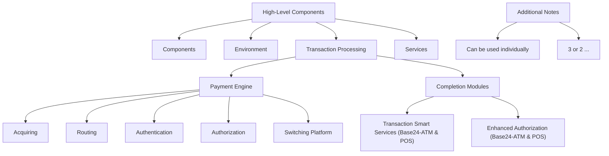

# 🧠 Payment Engine System Overview

## 🔧 High-Level Components
- Components
- Environment
- Transaction Processing
- Services

## ⚙️ Payment Engine Flow
1. Acquiring
2. Routing
3. Authentication
4. Authorization
5. Switching Platform

## 🏁 Completion Modules
- Transaction Smart Services (TSS) for Base24-ATM and Base24-POS (legacy)
- Enhanced Authorization for Base24-ATM and POS

## 📌 Additional Notes
- Can be used individually
- 3 or 2 ...
```

