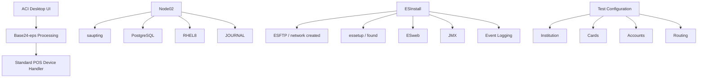

# 🛠️ BASE24-eps Environment Setup Notes

## 🔄 Installation & Environment Configuration
- 📦 **Node02 Components**:
  - Setup
  - PostgreSQL
  - RHEL8
  - JOURNAL

- 💻 **Desktop & Interface Tools**:
  - ACI Desktop User Interface
  - Base24-eps processing
  - Standard POS Device Handler (SPDH)

## 📚 Guides & Documentation
- `BASE24-eps 203.0 Linux-UNIX Installation Guide.pdf`
- `Operation guide for the Linux/UNIX BASE24-eps 2.6.10`

## 🔧 Testing Configuration Data
- Institution
- Cards
- Accounts
- Routing

## 🌐 ES-Install Workflow
- ESFTP / network created
- essetup / found
- ESweb
- JMX
- Event Logging

---

