# 🔁 Transaction Routing and System Paths Overview

## 🧭 Route Parameters
1. Destination Profile
2. Transaction Code
3. From: Account Type
4. To: Account Type
5. Source Profile
6. Method (optional)
7. Floor Limit

## 🎯 Destination Paths
- **Primary Destination**
  - Card Prefix
  - Customer Identifier
  - Withdrawal

- **Alternative Destinations**
  - Alternative 1 Destination
  - Alternative 2 Destination

- **Stand-in**

## 🔀 Routing Options
Choose one of three path types:
- 🌐 External Network
- 🖥️ External Host System
- 🧠 Internal Authorization Scripts

## 🔄 Sequential Routing
- Calls external application during pre-authorization or pre-auth script phase
- Common use case: Anti-fraud + Real-time screen

## 📦 Key System Elements
- **TDE**: Transaction Data Element
- **IS**: Integrated Server

## 🛡️ Network Defense
### NOM (Network Overload Manager)
- Protects against:
  - Overload
  - Denial of Service
  - Flood of queries from external systems

## 💳 Scheme Models
- **3-Party Scheme**
  - Cardholder
  - Merchant
  - Issuer/Acquirer *(e.g., American Express, Discover)*

- **4-Party Scheme**
  - Cardholder
  - Merchant
  - Issuer
  - Acquirer

## 📊 Flowchart Representation

```mermaid
flowchart TD
    RP[Route Parameters] --> DP[Destination Profile]
    RP --> TC[Transaction Code]
    RP --> FAT[From: Account Type]
    RP --> TAT[To: Account Type]
    RP --> SP[Source Profile]
    RP --> M["Method (optional)"]
    RP --> FL[Floor Limit]

    Destinations --> Primary[Primary Destination]
    Primary --> CP[Card Prefix]
    Primary --> CI[Customer Identifier]
    Primary --> WD[Withdraw]

    Destinations --> Alt1[Alternative 1 Destination]
    Destinations --> Alt2[Alternative 2 Destination]
    Destinations --> Standin[Stand-in]

    RoutingOptions --> EN[External Network]
    RoutingOptions --> EHS[External Host System]
    RoutingOptions --> IAS[Internal Auth Scripts]

    SeqRouting[Sequential Routing] --> ExternalApp[External Application Call]
    SeqRouting --> UseCase[Anti-fraud / RT Screen]

    SystemElements --> TDE[Transaction Data Element]
    SystemElements --> IS[Integrated Server]

    Defense[NOM: Network Overload Manager] --> Overload
    Defense --> DOS[Denial of Service]
    Defense --> Flood[Flood of Queries]

    SchemeModels --> ThreeParty[3-Party Scheme]
    ThreeParty --> Cardholder3
    ThreeParty --> Merchant3
    ThreeParty --> Issuer3

    SchemeModels --> FourParty[4-Party Scheme]
    FourParty --> Cardholder4
    FourParty --> Merchant4
    FourParty --> Issuer4
    FourParty --> Acquirer4
```

