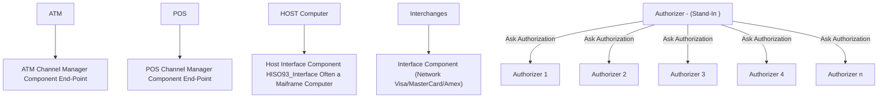

# 🔌 Network Management Architecture Overview

## 📟 Channel Endpoints
- **ATM**
  - ATM Channel Manager Component
  - Endpoint

- **POS**
  - Merchant Channel Manager Component
  - Endpoint

## 🖥️ Host Interfaces
- Host Interface Component
- Interface #15093 (Mainframe Host Computer)

## 🔄 Interchange Component
- Interchange Interface

## 💬 Message Properties
- Network Management Messages
  - Do not have processing code
  - Defined by MTI (Message Type Indicator)

## ✅ Authorization Station
- **Authorizers**:
  - Authorizer 1
  - Auth 2
  - Auth 3
  - Auth _n_
- Asks Authorization Host for decision
- 
## 📈 Flowchart Representation

