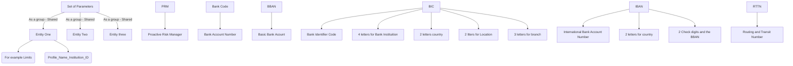

# 🏦 Banking Identifiers and Routing Standards

## 🛡️ Profile Naming Convention
- `profile.name_institution_ID`

## 🔍 Identification Codes
| Code  | Description                          |
|-------|--------------------------------------|
| PRM   | Proactive Risk Manager               |
| BBAN  | Basic Bank Account Number            |
| BIC   | Bank Identifier Code                 |
| IBAN  | International Bank Account Number    |
| RTTN  | Routing and Transit Number           |

### 🔡 IBAN Structure
- **2 Characters**: Country Code
- **2 Digits**: Check Digits
- **Rest**: BBAN

## 🧩 BIC Structure
- **4 Letters**: Bank Code
- **2 Letters**: Country Code
- **2 Characters**: Location Code
- **3 Characters**: Branch Code (optional)

## 📊 Flowchart of Banking Identifiers

